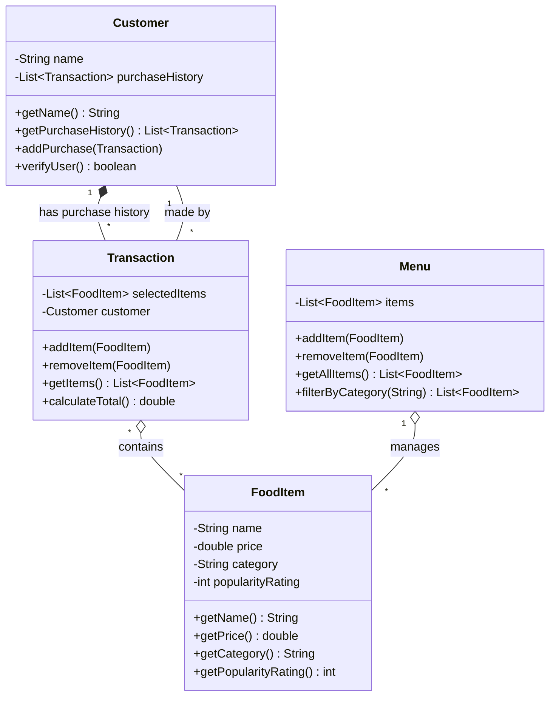

# ByteBites UML Class Diagram

## Core Classes Based on Requirements

## Class Descriptions

### Customer
- **Purpose**: Manage customers and track their purchase history for user verification
- **Key Attributes**: 
  - `name`: Customer's name
  - `purchaseHistory`: List of all past transactions
- **Key Methods**:
  - `verifyUser()`: Verify the customer is a real user based on purchase history
  - `addPurchase()`: Add a new transaction to history

### FoodItem
- **Purpose**: Represent specific food items that customers can browse
- **Key Attributes**:
  - `name`: Item name (e.g., "Spicy Burger", "Large Soda")
  - `price`: Item price
  - `category`: Category classification (e.g., "Burgers", "Drinks", "Desserts", "Sides")
  - `popularityRating`: Rating indicating item popularity

### Menu
- **Purpose**: Manage the full collection of food items with filtering capabilities
- **Key Attributes**:
  - `items`: Digital list holding all available food items
- **Key Methods**:
  - `filterByCategory()`: Filter items by category (e.g., "Drinks", "Desserts")
  - `addItem()` / `removeItem()`: Manage the collection

### Transaction
- **Purpose**: Group selected items into a single transaction/order
- **Key Attributes**:
  - `selectedItems`: List of items the customer picked
  - `customer`: Reference to the customer making the purchase
- **Key Methods**:
  - `calculateTotal()`: Compute the total cost of all selected items
  - `addItem()` / `removeItem()`: Manage items in the transaction

## Relationships

1. **Customer → Transaction** (1 to many): Each customer has multiple transactions in their purchase history
2. **Transaction → FoodItem** (many to many): Each transaction contains multiple food items
3. **Transaction → Customer** (many to 1): Each transaction is made by one customer
4. **Menu → FoodItem** (1 to many): The menu manages all available food items
