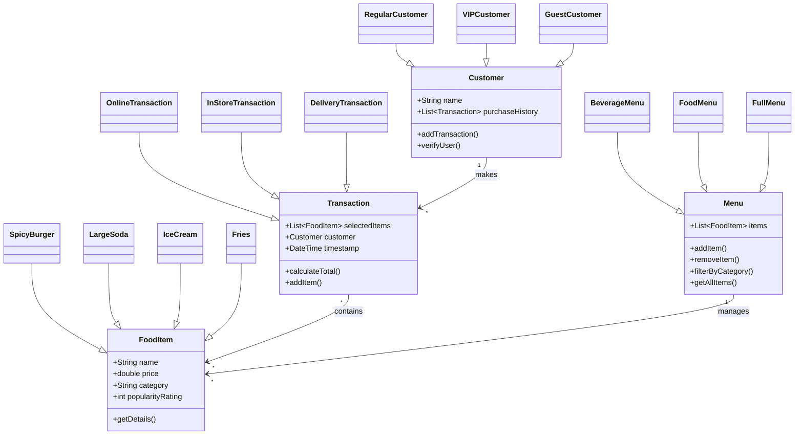

# ByteBites UML Class Diagram

```mermaid
classDiagram
    class Customer {
        +String name
        +List~Transaction~ purchaseHistory
        +addTransaction()
        +verifyUser()
    }
    
    class FoodItem {
        +String name
        +double price
        +String category
        +int popularityRating
        +getDetails()
    }
    
    class Menu {
        +List~FoodItem~ items
        +addItem()
        +removeItem()
        +filterByCategory()
        +getAllItems()
    }
    
    class Transaction {
        +List~FoodItem~ selectedItems
        +Customer customer
        +DateTime timestamp
        +calculateTotal()
        +addItem()
    }
    
    class RegularCustomer
    class VIPCustomer
    class GuestCustomer
    
    class SpicyBurger
    class LargeSoda
    class IceCream
    class Fries
    
    class BeverageMenu
    class FoodMenu
    class FullMenu
    
    class OnlineTransaction
    class InStoreTransaction
    class DeliveryTransaction
    
    RegularCustomer --|> Customer
    VIPCustomer --|> Customer
    GuestCustomer --|> Customer
    
    SpicyBurger --|> FoodItem
    LargeSoda --|> FoodItem
    IceCream --|> FoodItem
    Fries --|> FoodItem
    
    BeverageMenu --|> Menu
    FoodMenu --|> Menu
    FullMenu --|> Menu
    
    OnlineTransaction --|> Transaction
    InStoreTransaction --|> Transaction
    DeliveryTransaction --|> Transaction
    
    Customer "1" --> "*" Transaction : makes
    Transaction "*" --> "*" FoodItem : contains
    Menu "1" --> "*" FoodItem : manages
```